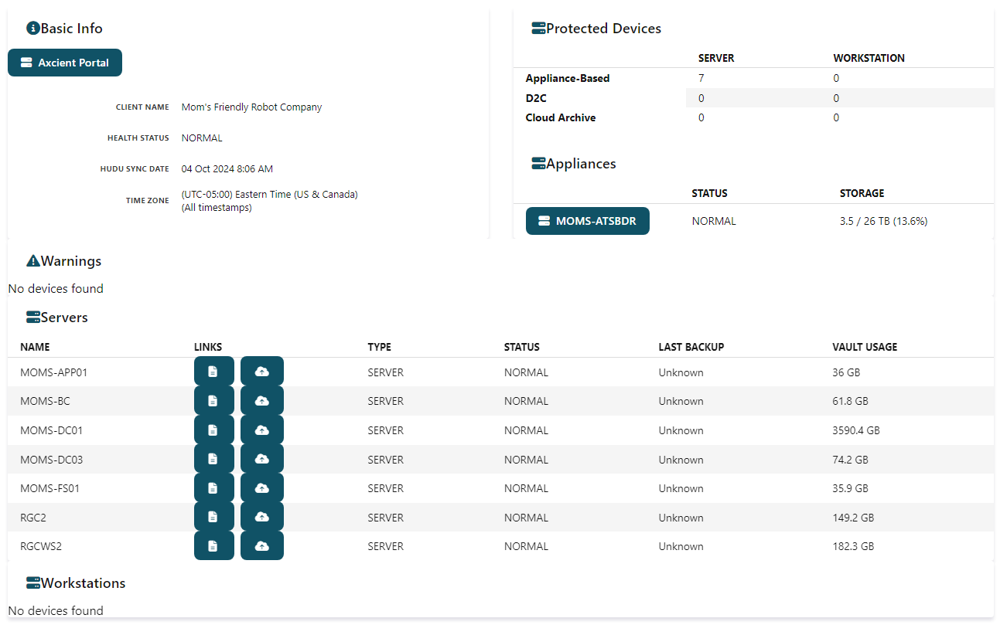
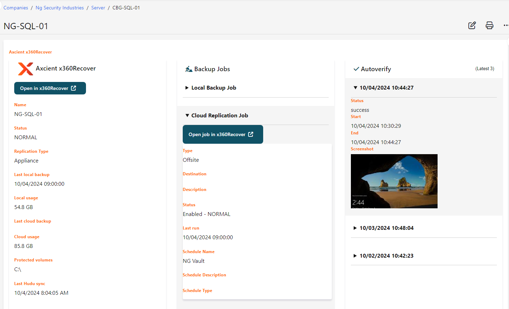
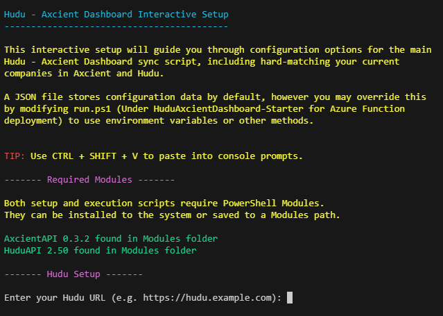
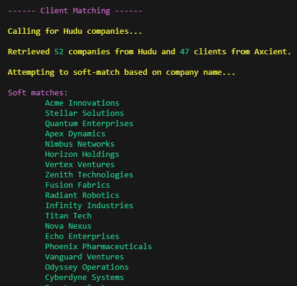
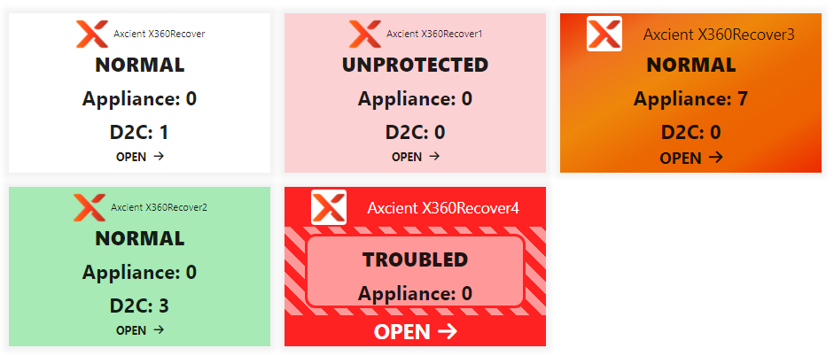

# Hudu-Axcient Dashboard

Bring Axcient into Hudu!

Hudu-Axcient Dashboard is a PowerShell-based helper to bring status information and links from [Axcient
x360Recover](https://axcient.com/products/x360recover/) cloud backup service into [Hudu](https://hudu.com/) documentation system.

Inspired by [Luke's scripts](https://mspp.io/) and the [CIPP](https://cipp.app) Hudu integration, Hudu-Axcient Dashboard
is designed to create a per-client overview dashboard via Magic Dash, and / or a per-device status at the top of a device asset.

## Features

### Magic Dash company overview

### In-Asset device data

### Interactive Setup & Client Matching

### Magic dash shade support

### Azure Function & Stand-alone deployments

- **Single-File** self-contained run option for self-hosted environments
- **Azure Function** Durable function deployment for scalability. Supports 800+ clients.

## Setup

- Clone repo, download files or retrieve just the necessary files from Releases
- Run `setup.ps1` for fully-guided setup

## Client matching

During setup, soft-matching will attempt to match Axcient companies to Hudu clients based on an exact
name match. For any companies not matched this way setup will prompt you repeatedly to select matching
pairs from a gridview.

Additionally, during run-time Hudu-Axcient Dashboard can automatically attempt to soft-match any unmatched
companies. This does *not* update the match list, but allows updating companies immediately when new clients
are added / names corrected on otherwise-unmatched pairs.

## Styling

`css-global.css` contains a set of suggested tweaks to apply to the custom CSS for Hudu. Most of these are
already present if you are syncing CIPP or utilizng any of Luke's scripts.

The primary settings file `config.json` allows specifying a custom CSS class (Dashboard shade) for healthy and
not-healthy status. By default, the built-in `success` and `danger` classes are used. If not specified, no
styling is applied.

`css-magicdash.css` contains example magic dash styling. This styling is added to the custom CSS list in Hudu.
Magic Dash styling is highly extensible, these are basic examples.

## Wishlist

- [X] Magic Dash company overview
- [X] Per-device asset custom field
- [X] **Deployment options**:
  - [X] Azure Functions: Deployed as a durable function to support 800+ clients
  - [X] Stand-alone: Use on your own server or other services that allow long-running scripts.
- [X] Guided interactive setup with client matching function
- [X] Auto-match feature to soft-match unmatched clients on each run
- [X] Support custom CSS Shade / selector for decorating Magic Dash cover
- [ ] Parsing appliance replication completely / separating from local replication and D2C in asset details
- [ ] Arbitrary / specific time zone settings